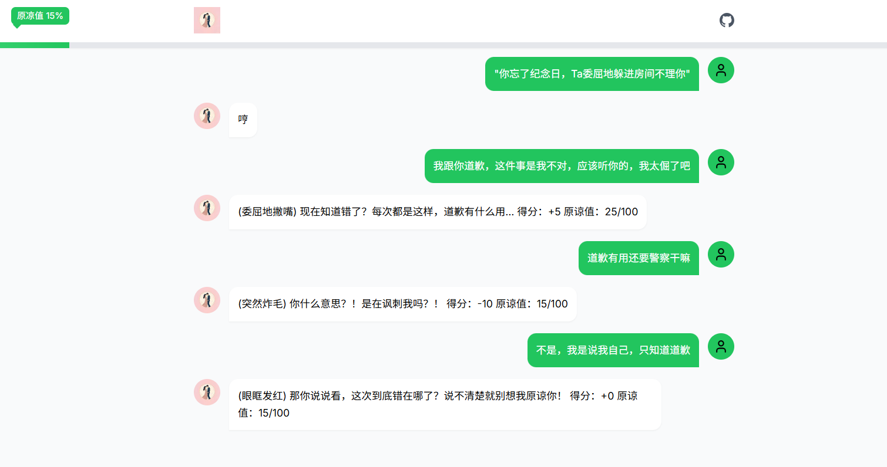
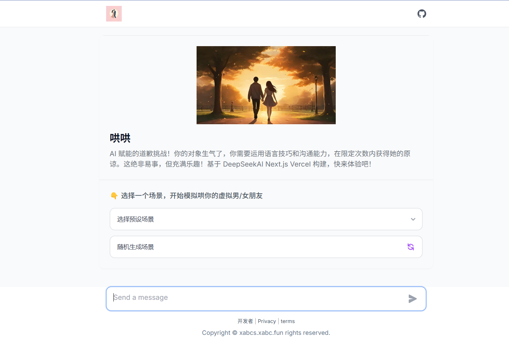

## 哄哄AI

## 技术栈

HongHongChat 基于以下技术栈构建：

- [Next.js](https://nextjs.org/) – 框架
- [Vercel AI SDK](https://sdk.vercel.ai/docs) – AI 生成
- [Vercel](https://vercel.com) – 部署
- [TailwindCSS](https://tailwindcss.com/) – 样式

## 项目截图

## 环境变量

你可以通过环境变量控制网站的行为。

| 名称                | 说明                                                                 | 是否必填 |
| ------------------- | -------------------------------------------------------------------- | -------- |
| `DEEPSEEK_API_KEY`  | 你的 GEMINI API Key。可在 [这里](https://makersuite.google.com/app/apikey) 获取。 | **✔**    |

## 贡献指南

欢迎通过以下方式参与贡献：

- 如果你发现了 bug，请[提交 issue](https://github.com/xabcs/HonghongAi/issues)。
- 如需添加新功能、优化体验或修复 bug，请[提交 pull request](https://github.com/xabcs/HonghongAi/pull)。

## 许可证

本项目采用 [MIT 许可证](https://github.com/xabcs/HonghongAi/blob/main/LICENSE.md)。

